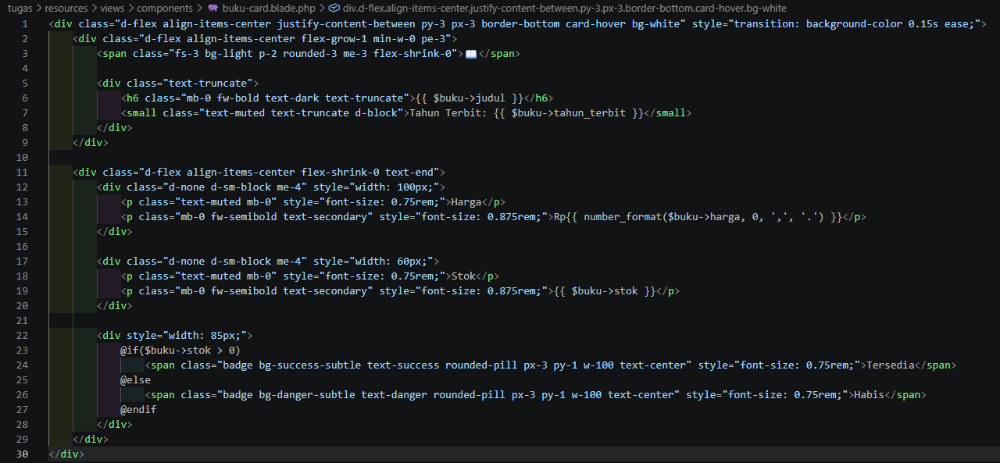
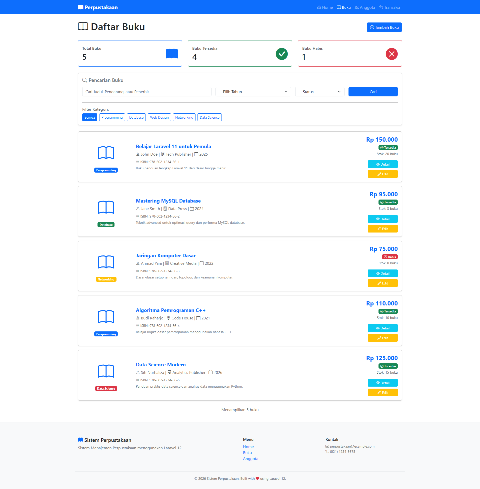
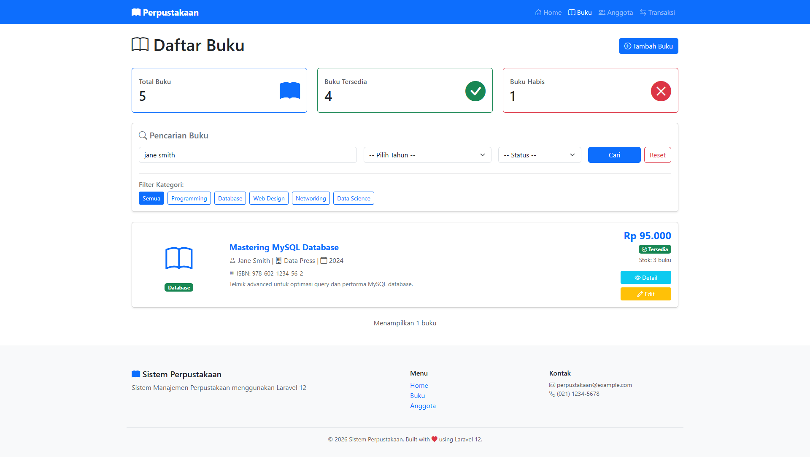

# Dashboard & Blade Component — Pertemuan 11

**Nama:** Puspa Dwi Setyorini  
**NIM:** 60324003  
**Prodi:** Informatika  
**Semester:** 4  
**Mata Kuliah:** Pemrograman Web II  
**Repository:** [Link GitHub](https://github.com/Puspa79/Tugas-Pertemuan-9-PENGENALAN-FRAMEWORK-LARAVEL-MVC)

## Perintah yang Dijalankan:
* `php artisan make:controller DashboardController`
* Menambahkan route dashboard
* Membuat view dashboard
* Menampilkan statistik buku dan anggota

## Data yang Ditampilkan
* Total buku
* Buku tersedia
* Buku habis
* Total anggota
* Anggota aktif
* Anggota nonaktif
* 5 buku terbaru
* 5 anggota terbaru
* Quick links menu utama

---

## TUGAS 1 - Halaman Dashboard Perpustakaan
### 1. Deskripsi Fitur
Membuat tampilan dashboard utama aplikasi manajemen perpustakaan "PerpusCore" menggunakan template layout Bootstrap 5 terintegrasi (`layouts/app.blade.php`). Halaman ini memuat 6 kotak informasi statistik akumulasi data secara dinamis dari database, serta dilengkapi menu navigasi *Quick Links* untuk mempermudah akses pengelolaan data.

### 2. Hasil Implementasi Tampilan Dashboard
Menampilkan halaman dashboard utama yang memuat navigasi navbar atas, informasi statistik total, buku tersedia/habis, status anggota, serta tautan menu pintas kelola data.

---

## TUGAS 2 - Membuat Blade Component Reusable Untuk Card Buku
### 1. Deskripsi Fitur
Membuat komponen Blade terpisah (`<x-buku-card>`) yang bersifat *reusable* untuk merendering item daftar buku secara dinamis. Komponen diatur menggunakan utility class Bootstrap 5 dengan modifikasi layouting posisi kolom terpasang (fixed spacing) agar posisi lencana status (`Tersedia` / `Habis`) terkunci sejajar secara vertikal lurus demi estetika kerapian antarmuka halaman.

### 2. Potongan Kode Komponen (`buku-card.blade.php`)
Berikut susunan kode pada file komponen kartu buku untuk mengatur tata letak simetris komponen teks dan badge status:

* **Hasil Card Buku**

---

## TUGAS 3 - Search & Filter Buku Advanced

### 1. Deskripsi Fitur
Menambahkan fitur pencarian kata kunci dan penyaringan (*filter*) data buku tingkat lanjut secara dinamis. Fitur ini memungkinkan pengguna mencari buku berdasarkan kombinasi judul, pengarang, penerbit, kategori, tahun terbit, serta status ketersediaan stok di perpustakaan melalui satu form terpadu.

**Spesifikasi Form & Backend:**
* **Form Search:** Input Keyword (Judul/Pengarang/Penerbit), Dropdown Kategori, Dropdown Tahun Terbit, dan Dropdown Ketersediaan (Semua/Tersedia/Habis).
* **Route:** `/buku/search` dengan metode HTTP `GET`.
* **Controller Method:** Mengimplementasikan `public function search(Request $request)` di dalam `BukuController` dengan memanfaatkan Eloquent Query Builder (`Buku::query()`) dan mengembalikannya ke halaman `buku.index`.

---

### 2. Bukti Data Terseeder di phpMyAdmin
Sebelum fitur pencarian diuji, database telah diisi dengan minimal 5 data uji coba memanfaatkan Database Seeder (`BukuSeeder.php` dan `AnggotaSeeder.php`):

* **Tabel Buku (`bukus`):** Memperlihatkan data buku hasil eksekusi seeder dengan struktur kolom lengkap (`id`, `isbn`, `judul`, `pengarang`, `penerbit`, `tahun_terbit`, `jumlah_halaman`, `kategori`, `stok`, `harga`, `sinopsis`).

* **Tabel Anggota (`anggotas`):** Memperlihatkan data anggota hasil eksekusi seeder dengan struktur kolom lengkap (`id`, `kode_anggota`, `nama`, `email`, `telepon`, `alamat`, `tanggal_lahir`, `jenis_kelamin`, `pekerjaan`, `tanggal_daftar`, `status`).

---

### 3. Bukti Implementasi Fitur & Pengujian (Halaman Antarmuka)
* **Halaman Form Pencarian & Filter Advanced:** Menampilkan antarmuka komponen pencarian buku beserta hasil pencarian yang berhasil ter-render pada view `buku.index` setelah melakukan pencarian data spesifik.
