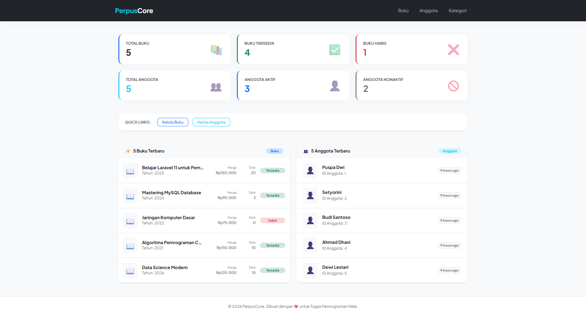
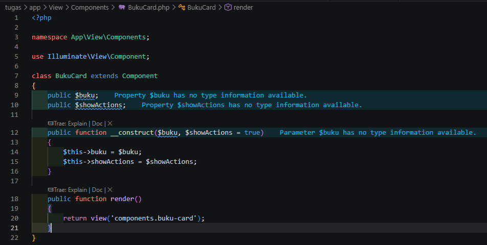
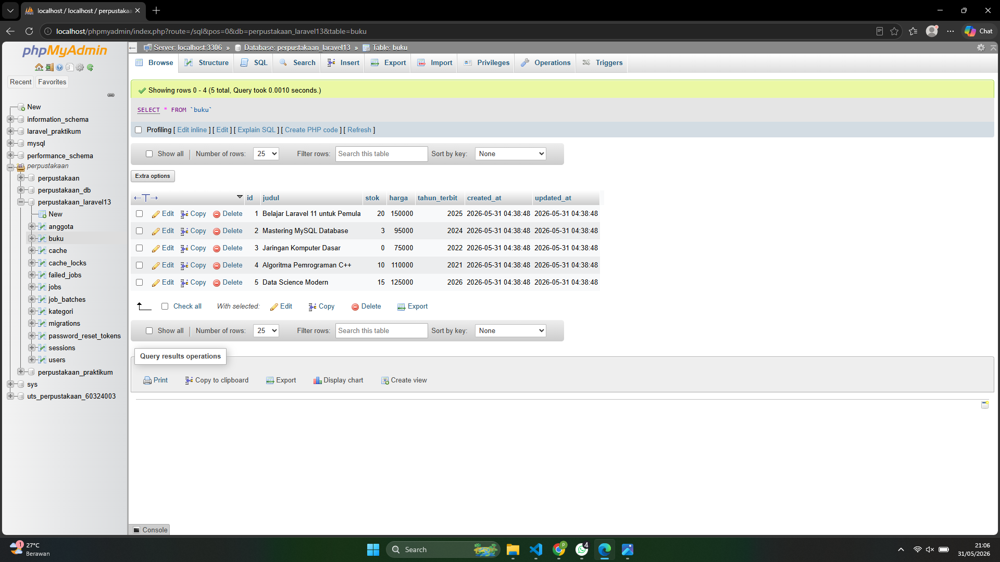
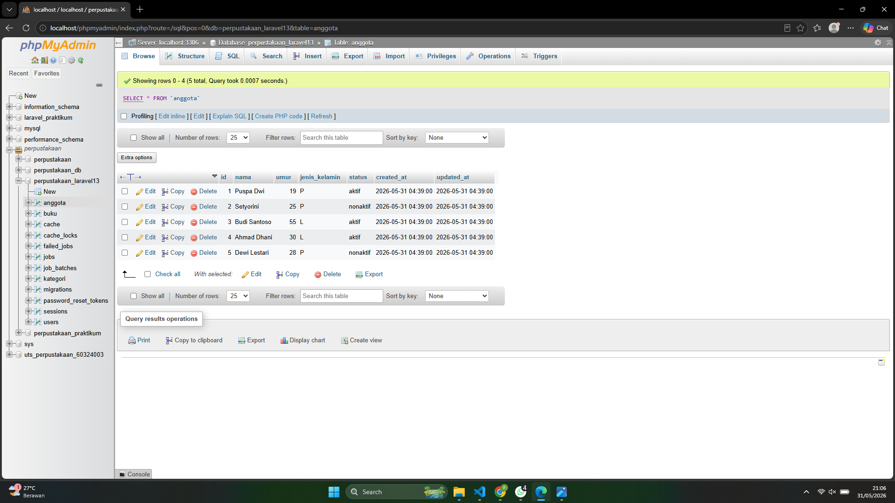

# Dashboard & Blade Component — Pertemuan 11

**Nama:** Puspa Dwi Setyorini  
**NIM:** 60324003  
**Prodi:** Informatika  
**Semester:** 4  
**Mata Kuliah:** Pemrograman Web II  
**Repository:** [Link GitHub](https://github.com/Puspa79/Tugas-Pertemuan-9-PENGENALAN-FRAMEWORK-LARAVEL-MVC)

## Perintah yang Dijalankan:
* `php artisan make:controller DashboardController`
* Menambahkan route dashboard
* Membuat view dashboard
* Menampilkan statistik buku dan anggota

## Data yang Ditampilkan
* Total buku
* Buku tersedia
* Buku habis
* Total anggota
* Anggota aktif
* Anggota nonaktif
* 5 buku terbaru
* 5 anggota terbaru
* Quick links menu utama

---

## TUGAS 1 - Halaman Dashboard Perpustakaan
### 1. Deskripsi Fitur
Membuat tampilan dashboard utama aplikasi manajemen perpustakaan "PerpusCore" menggunakan template layout Bootstrap 5 terintegrasi (`layouts/app.blade.php`). Halaman ini memuat 6 kotak informasi statistik akumulasi data secara dinamis dari database, serta dilengkapi menu navigasi *Quick Links* untuk mempermudah akses pengelolaan data.

### 2. Hasil Implementasi Tampilan Dashboard
Menampilkan halaman dashboard utama yang memuat navigasi navbar atas, informasi statistik total, buku tersedia/habis, status anggota, serta tautan menu pintas kelola data.

---

## TUGAS 2 - Membuat Blade Component Reusable Untuk Card Buku
### 1. Deskripsi Fitur
Membuat komponen Blade terpisah (`<x-buku-card>`) yang bersifat *reusable* untuk merendering item daftar buku secara dinamis. Komponen diatur menggunakan utility class Bootstrap 5 dengan modifikasi layouting posisi kolom terpasang (fixed spacing) agar posisi lencana status (`Tersedia` / `Habis`) terkunci sejajar secara vertikal lurus demi estetika kerapian antarmuka halaman.

### 2. Potongan Kode Komponen (`buku-card.blade.php`)
Berikut susunan kode pada file komponen kartu buku untuk mengatur tata letak simetris komponen teks dan badge status:

---

## TUGAS 3 - Mengisi Data Melalui Seeder Database (Minimal 5 Data)
### 1. Deskripsi Fitur
Membuat dan mengonfigurasi file `BukuSeeder.php` serta `AnggotaSeeder.php` untuk memasukkan data uji coba (dummy data) ke dalam database secara otomatis melalui perintah `php artisan db:seed`. Masing-masing tabel dipastikan terisi minimal 5 baris data agar layout daftar terbaru pada dashboard ter-render dengan seimbang dan presisi.

### 2. Bukti Data Berhasil Tersimpan di phpMyAdmin
* **Tabel Buku (`buku`):** Memperlihatkan 5 baris data buku hasil eksekusi database seeder dengan atribut kolom lengkap (`id`, `judul`, `stok`, `harga`, `tahun_terbit`).

* **Tabel Anggota (`anggota`):** Memperlihatkan 5 baris data anggota hasil eksekusi database seeder dengan atribut kolom lengkap (`id`, `nama`, `umur`, `jenis_kelamin`, `status`).
